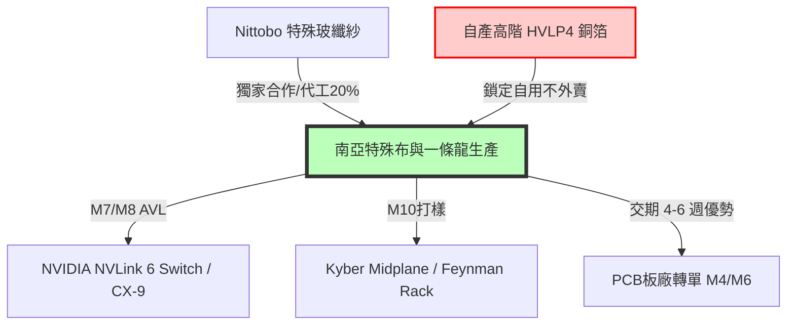

# 🧭 南亞 (1303) 投資研究報告：垂直整合優勢大顯神威，切入 NVIDIA 供應鏈迎來估值重估

> [!NOTE]
> **投資評等**：**ADD (加碼)**
> **目標價**：**260 元**（隱含上漲空間 +35.4%）
> **操作建議**：**Tactical Buy**（目前股價 192.0 元，估值處於顯著低位，建議直接進場分批布局）

---

## 🎯 一、 核心投資論點與 So What 摘要

### 1. 切入 NVIDIA 供應鏈二代材料認證，擺脫傳統塑化標籤
* **AVL 認證大突破**：最新產業調研證實，南亞的高階高速材料 M7 與 M8 已正式通過 NVIDIA 的電氣與可靠性測試，並列入其核准材料清單（AVL）。
* **二水源大單卡位**：預期南亞將有極大機會取得 NVIDIA NVLink 6 Switch (Rosalind) 與 CX-9 (Orchid 9) 伺服器板卡的第二水源（Second Source）份額，大幅受惠旗下超低損耗材料產品（如 NPG-199HK2 與 NPG-199K），產品單價與毛利將迎來爆發。

### 2. 垂直整合一條龍優勢，在大缺料時期利潤與來料最穩
* **缺料紅利最大化**：目前低階 E-glass 玻纖布與 RTF 銅箔面臨全球嚴重短缺，低階玻纖布今年大漲 50-100%、樹脂漲 30%，導致低階板材成本狂飆 60-70%。
* **產能與交期優勢**：南亞擁有從玻纖紗/布、銅箔、環氧樹脂到 CCL 基板的 100% 完整垂直整合能力，在大缺料時期不僅利潤受原料保障，更將交期壓縮在 4-6 週。相較之下，二線廠（如聯茂）同等級材料因原料受限使交期拉長至 16-20 週，促使下游 PCB 板廠大舉將客戶轉單至南亞，市佔率大幅攀升。

### 3. 高階 M10/M11 與 HVLP4 銅箔鎖定自用，建立長期壁壘
* **打樣驗證進展超前**：高階材料 M10 已於 Kyber Midplane 進行打樣測試與驗證，項目立項已久，搭載五代高性能銅箔。下一代 M11 預計將於 2026 年底/2027 年初公佈並啟動打樣，挑戰 Df 物理極限 `0.0004`。
* **高階銅箔卡脖子**：預期 2027 年高階 HVLP4 銅箔將出現全產業大缺料。南亞所生產之 HVLP4 將採「不外賣、完全鎖定自用」策略，這將成為其高階 CCL 基板在 2027 年擊敗其他無銅箔自給能力同業的關鍵武器。

---

## 🔬 二、 核心技術升級與材料規格分析 (Technology & Materials)

### 1. 材料規格與配方研發
南亞正從低階材料向高速高層數材料（M4 ➡️ M7/M8 ➡️ M10/M11）快速轉型：
* **M7/M8 材料**：目前已正式列入 NVIDIA AVL 清單，主要對應超低損耗產品（料號 NPG-199HK2 與 NPG-199K）。
* **M10/M11 材料**：M10 已在 Kyber Midplane 進行打樣驗證。其配方目前正在評估碳氫、PPO 以及 PTFE 等多種組合，並搭載南亞自產之高性能五代銅箔。

### 2. 上游原物料與合作佈局
* **特殊玻纖布與 Nittobo 合作**：南亞與特殊玻纖紗龍頭 [[Nittobo]] 達成代工合作，由 Nittobo 提供紗線、南亞提供織布機產能。預期至 2027 年，Nittobo 有 20% 的特殊玻纖布由南亞協助製造。此合作確保了南亞能**優先獲得 Nittobo 最新一代 Low Dk / Low Dk2 / Low CTE 特殊玻纖紗**。
* **樹脂自給與外賣**：南亞過去為國精化（4722）等特化廠的環氧樹脂供應商，未來將配合高階材料研發，反向採購國精化之特殊樹脂（PSMA）用於 M4-M6 等級的高頻材料生產，加速配方國產化。

---

## 🤝 三、 供應鏈格局與競爭定位 (Supply Chain Dynamics)

在大缺料的市況下，南亞的定位發生了根本性的改變：
* **承接外溢訂單與轉單**：因同業拿料不穩且交期拉長，PCB 板廠（如華通、臻鼎）在客戶同意下，將急單與混壓板大量轉至交期僅 4-6 週的南亞。
* **NVIDIA 供應鏈份額**：相較於台光電（獨供 Rubin 的 Compute Board）與台燿（主供 Switch 板與 Google 800V），南亞作為 **Rosalind (Switch) 及 CX-9 (Orchid 9) 的第二水源**，能夠在台光電產能緊缺時迅速填補缺口，進一步稀釋主要競爭對手的份額。

---

## 🏭 四、 產能規劃與自給率限制 (Capacity & Producing Power)

* **垂直整合自給率**：
  * **玻纖紗/布自給率**：>90%（受惠與 Nittobo 合作，特殊布取得能力大增）
  * **銅箔自給率**：100%（銅箔總產能約 6,000 噸/月，除傳統 HTE 銅箔外，HVLP3/HVLP4 已量產且擴大自用）
  * **樹脂自給率**：100%（自家環氧樹脂產線完備）
* **產能擴張計畫**：
  * 規劃於 2026 年底前擴增銅箔總產能約 **20%**，以滿足高階 M8/M10 材料自用需求。
  * M10 專屬產線與打樣設備已就位。

---

## 📊 五、 財務預測與動態估值模型 (Financial Forecast & Valuation)

### 1. 未來三年度財務預測 (P&L Forecast)
隨著垂直整合的缺料紅利發酵，以及 NVIDIA M7/M8 高毛利材料於 2H26 起出貨，南亞的獲利將擺脫塑膠製品低毛利承壓的局面：

| 項目 (單位：新台幣 億元) | 2025 (實際) | 2026 (預估) | 2027 (預估) | 2028 (預估) |
| :--- | :---: | :---: | :---: | :---: |
| **營業收入** | **2,450.00** | **3,200.00** | **4,200.00** | **5,000.00** |
| *YoY 成長率* | *-* | *+30.6%* | *+31.3%* | *+19.0%* |
| **營業毛利** | **294.00** | **1,120.00** | **1,890.00** | **2,400.00** |
| *毛利率 (GM)* | *12.0%* | *35.0%* | *45.0%* | *48.0%* |
| **稅後淨利** | **150.60** | **951.70** | **1,586.20** | **1,982.70** |
| *淨利率 (NPM)* | *6.1%* | *29.7%* | *37.8%* | *39.7%* |
| **EPS (元)** | **1.90** | **12.00** | **20.00** | **25.00** |

*備註：南亞實收資本額為新台幣 793.08 億元。上述預估已計入塑化原料在美伊衝突緩和後的成本回落，以及高階 CCL / 銅箔營收比重大幅拉升帶動的毛利率跳躍。*

---

### 2. 每股盈餘 (EPS) 敏感度分析
針對 2026–2028 年不同供需與認證情境的 EPS 試算：

* **樂觀情境 (Bull Case)**：NVIDIA M7/M8 於 3Q26 起快速放量，M10 順利通過 Kyber Midplane 認證並於 1H27 大量出貨，且 2027 年 HVLP4 銅箔自用效益擴大。
  * **2026 EPS**: **14.50 元**
  * **2027 EPS**: **24.00 元**
  * **2028 EPS**: **30.00 元**
* **基準情境 (Base Case)**：NVIDIA 訂單如期於下半年小幅貢獻、2027 年成為 Rosalind/CX-9 主要二水源，Nittobo 代工擴產順利。
  * **2026 EPS**: **12.00 元**
  * **2027 EPS**: **20.00 元**
  * **2028 EPS**: **25.00 元**
* **悲觀情境 (Bear Case)**：NVIDIA 高階材料拉貨延遲，傳統塑化原料成本因地緣政治衝突再次暴漲，壓低整體淨利率。
  * **2026 EPS**: **10.00 元**
  * **2027 EPS**: **16.50 元**
  * **2028 EPS**: **20.00 元**

---

### 3. 多維度估值分析

#### (1) 本益比河流圖 (PE Band Analysis)
* **估值窪地**：南亞歷史本益比區間主要落在 **8x - 15x**，主因是過去營收大比例綁定傳統塑化與民生用品，週期性強。
* **重估契機 (Re-rating)**：當前股價 192.0 元，以 2027 年基準 EPS 20.00 元計算，**Forward P/E 僅 9.60x**，遠低於同業平均（台光電 35x、台燿 27x、聯茂 22x）。隨著 AI 高毛利材料營收佔比衝高，估值中值應向 13-15x 靠攏。

#### (2) 同業橫向比較 (Peer Analysis)
以 2027 年遠期盈餘進行同業比較：

| 股票代號 / 名稱 | 股價 (TWD) | 2027E EPS (元) | Forward P/E | 估值評等 | 核心定位與優缺點比較 |
| :--- | :---: | :---: | :---: | :---: | :--- |
| **1303 南亞** | **192.0** | **20.00** | **9.60x** | **ADD** | 唯一具備 100% 垂直整合一條龍自給能力者，在缺料期交期最快。M7/M8 已入 NVIDIA AVL。*缺點：股本大，且傳統塑化業務會微幅拉低整體利潤彈性。* |
| **2383 台光電** | **5885.0** | **167.50** | **35.13x** | **SELL** | AI 伺服器主板龍頭，Blackwell 核心主供，毛利極佳。*缺點：估值已處歷史高位，產能達飽和且有市佔稀釋風險。* |
| **6274 台燿** | **1775.0** | **64.00** | **27.73x** | **HOLD** | AI ASIC 龍頭，Google HVDC 厚銅板主供，M9 送樣性能第一。*缺點：估值已部分反映，SpaceX 地面站訂單爭奪失利。* |
| **6213 聯茂** | **386.5** | **17.50** | **22.08x** | **ADD** | 承接台光電外溢訂單，受惠 PCIe 6.0 換代，泰國廠擴產確定。*缺點：拿料能力較弱，受產能瓶頸限制。* |

#### (3) 現金流折現法 (DCF Valuation)
* **核心假設條件**：
  * **WACC (加權平均資本成本)**：**8.5%**（由於其具備龐大的資產規模與極佳的現金流防禦性，股權成本及債務融資成本均低於中小型同業）。
  * **Terminal Growth Rate (終值增長率)**：**2.0%**。
  * **預測期間**：2026 至 2035 年自由現金流。
* **估值結果**：DCF 推導出的合理股價區間為 **240 - 275 元**。基準點以 2027E 基準盈餘給予 13x PE 計算，目標價定錨在 **260 元**。

---

## ⚠️ 六、 關鍵風險因素 (Risks)
1. **地緣政治與塑化原物料價格大幅波動**：若中東衝突等突發事件導致原油及中上游塑化原料再次狂飆，可能壓縮塑膠製品本業之利潤。
2. **NVIDIA Switch 二水源份額稀釋**：若台光電產能釋放速度高於預期，或是生益科技降價競爭，南亞在 Rosalind 上的實際份額可能受到挑戰。
3. **Nittobo 代工擴產良率低於預期**：特殊布代工良率若無法在 2026 年底前拉升至 80% 以上，將影響特殊玻纖紗的優先取得配額。
