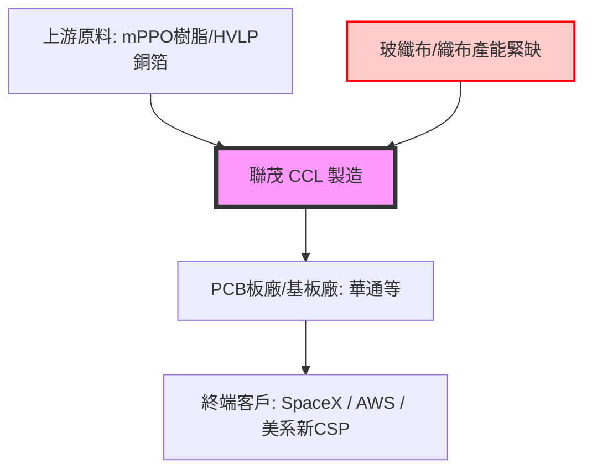

# 🧭 聯茂 (6213) 投資研究報告：PCIe 6.0 升級與 SpaceX 雙引擎，評價結構性重估

> [!NOTE]
> **投資評等**：**ADD (加碼)** 
> **目標價**：**525 元**（隱含上漲空間 +35.8%）
> **操作建議**：**Wait for Setup**（目前股價 386.5 元，建議拉回月線 360-370 元區間分批布局）

---

## 🎯 一、 核心投資論點與 So What 摘要

### 1. 通用伺服器 PCIe 6.0 平台換代與漲價雙引擎驅動
* **規格跳升**：2H26 PCIe 6.0 平台（AMD Venice 與 Intel Oak Stream）放量。主板層數由 18-22L 提升至 20-24L，材料規格從 M6 升級至 M7，帶動單機產值（ASP）提升 20-30%。聯茂在 AMD 伺服器平台佔比高，將是下半年最大受惠者。
* **價格調漲**：因上游玻纖布、銅箔與樹脂緊缺，公司於 2Q26 啟動全產品線漲價。Q2 單季 ASP 漲幅達 30%（含 Q1 遞延漲價），H2 預估每季保守調漲 10-15%。漲價效益於 5月營收中驗證（單月自結 EPS 高達 1.21 元），顯示毛利率擴張效應顯著。

### 2. 衛星與高階 AI 認證進展超預期
* **SpaceX 地面接收站訂單**：成功搶下 SpaceX 地面接收站原由龍頭廠 100% 獨供中釋出的 30% M7 級訂單，打破獨佔格局。規格為 M7，預計 1H27 放量出貨，此訂單亦是泰國廠擴產的重要推手。
* **新 CSP 大客戶送樣**：2H26 新增美系 AI CSP 大客戶送測 M4-M10 全系列材料，目標切入 OAM（加速器模組）與 UBB（通用基板），預估 2027 下半年至 2028 年進入量產，毛利極佳，為中長期估值天花板的重估關鍵。

---

## 🔬 二、 核心技術升級與材料規格分析 (Technology & Materials)

### 1. CCL 材料代際升級與結構優化
聯茂產品線目前正經歷從中低階（M2/M4）往高階高速（M6/M7/M8）的結構性調整，預期毛利率將從歷史低點的 11-13% 向上挑戰 **22-25%**。

* **M7 材料（PCIe 6.0 與低軌衛星天線）**：為今年營收主力成長點，價格約 RMB 650-780/張（相較於傳統 FR4 的 RMB 260-270/張），預估年底出貨張數佔比將提升至 **10%** 以上。
* **M8 材料（AI 交換機與伺服器主板）**：目前主攻 AI 高階交換機。預估年底營收佔比達 **3-5%**。
* **M9/M10 材料（Rubin 平台與超高階 ASIC）**：已全系列送樣美系 CSP 客戶，預計 2027 年下半年放量。此等級材料若放量，毛利率有望直逼 40% 以上。

### 2. 配方與上游玻纖布/樹脂供應
高階高速 CCL 的配方（樹脂/玻纖布）是決定其成本與競爭力的核心。
* **樹脂配方**：高階產品主要使用 **mPPO（改性聚苯醚）** 樹脂，並積極尋求台日 Second Source 合作以降低成本。
* **玻纖布瓶頸**：目前全球玻纖布「織布產能」因機器產能受限而出現嚴重短缺，預期此短缺將持續 6-12 個月。由於玻纖布卡脖子，聯茂 2026 年前三季的產能利用率（稼動率）預期壓制在 70-75% 上限，需待 4Q26 來料緩解。

---

## 🤝 三、 供應鏈格局與競爭定位 (Supply Chain Dynamics)

* **上游端**：聯茂目前積極洽談高階 HVLP 銅箔的台、日供應商，以應對 2027 年可能出現的高高階銅箔大缺貨；同時，德宏（5475）等本土 Q-glass 石英布供應鏈的認證也是後續降本的觀察重點。
* **競爭端**：在 SpaceX 訂單中，原本台光電產能吃緊釋出 30% 份額，台燿積極爭取，但最終由聯茂憑藉較穩定的中階材料良率與泰國廠產能佈局勝出，確立了二線廠中率先承接龍頭外溢訂單的地位。

---

## 🏭 四、 產能規劃與爬坡限制 (Capacity & Bottlenecks)

### 1. 泰國廠產能爬坡路徑
泰國廠是聯茂避開地緣政治風險、接單美系客戶的戰略核心：
* **Phase 1 (第一期)**：規劃月產能 60 萬張。目前已開出 30 萬張/月，預計 2026 年底前開出剩餘 30 萬張。
* **Phase 2 (第二期)**：已通過 33.28 億泰銖資本支出，規劃新增 60 萬張/月。預計 2027 下半年裝機、1H28 分批量產，泰國總月產能將達 **120 萬張**。

### 2. 全球產能配置結構 (月產能)
* **中國江西廠**：240 萬張（集團核心生產據點，佔產能近 42%）
* **中國無錫廠**：165 萬張
* **中國東莞廠**：45 萬張
* **台灣新竹廠**：60 萬張
* **泰國廠**：預計 2026 年底達 60 萬張，2028 年底達 120 萬張。
* **總產能**：2026 年底合計約 **570 萬張/月**，2028 年達 **630 萬張/月**。

> [!WARNING]
> **產能主要風險**：高階上膠機（Impregnation machine）交期長達 1.5 年以上，今年年中下單之設備預計最快 2027 年底才能到廠，因此 2027 年產能增幅受限。

---

## 📊 五、 財務預測與動態估值模型 (Financial Forecast & Valuation)

### 1. 未來三年度財務預測 (P&L Forecast)
基於泰國廠擴產進度、M7 產品組合佔比提升及全線調價 20% 的假設，預估損益表如下：

| 項目 (單位：新台幣 億元) | 2025 (實際) | 2026 (預估) | 2027 (預估) | 2028 (預估) |
| :--- | :---: | :---: | :---: | :---: |
| **營業收入** | **374.20** | **470.80** | **650.00** | **852.00** |
| *YoY 成長率* | *-* | *+25.8%* | *+38.1%* | *+31.1%* |
| **營業毛利** | **46.78** | **87.09** | **162.50** | **238.56** |
| *毛利率 (GM)* | *12.5%* | *18.5%* | *25.0%* | *28.0%* |
| **營業利益** | **18.71** | **49.43** | **110.50** | **161.88** |
| *營業利益率 (OPM)* | *5.0%* | *10.5%* | *17.0%* | *19.0%* |
| **稅後淨利** | **14.97** | **35.78** | **67.02** | **99.58** |
| *淨利率 (NPM)* | *4.0%* | *7.6%* | *10.3%* | *11.7%* |
| **EPS (元)** | **4.16** | **9.88** | **17.50** | **26.00** |

---

### 2. 每股盈餘 (EPS) 敏感度分析
針對 2026–2028 年不同供需情境的 EPS 試算：

* **樂觀情境 (Bull Case)**：玻纖布織布產能瓶頸於 3Q26 提前緩解，新 CSP 客戶認證於 1H27 提前放量。
  * **2026 EPS**: **10.80 元**
  * **2027 EPS**: **20.20 元**
  * **2028 EPS**: **32.00 元**
* **基準情境 (Base Case)**：玻纖布缺料持續至年底，泰國廠擴產如期，M7 產品年底佔比達 10%。
  * **2026 EPS**: **9.88 元**
  * **2027 EPS**: **17.50 元**
  * **2028 EPS**: **26.00 元**
* **悲觀情境 (Bear Case)**：上游玻纖布大缺料延續至 2027 年，泰國廠裝機延誤，調價無法完全轉嫁。
  * **2026 EPS**: **8.14 元**
  * **2027 EPS**: **14.73 元**
  * **2028 EPS**: **20.00 元**

---

### 3. 多維度估值分析

#### (1) 本益比河流圖 (PE Band Analysis)
聯茂歷史本益比河流圖區間主要落在 **12x - 25x**。
* **結構性重估 (Re-rating)**：過往因低階消費型材料佔比高，市場給予 15-18x 中值本益比。隨著高速材料（M7/M8）營收佔比挑戰 40% 以上，獲利模式向台光電（P/E 35x）及台燿（P/E 27-28x）靠攏，估值中值應上移至 **25x - 30x**。
* **目前水位**：以目前股價 386.5 元、2027 年基準 EPS 17.50 元計算，**Forward P/E 僅 22.08x**，估值仍未完全反映 PCIe 6.0 與低軌衛星的重估紅利。

#### (2) 同業橫向比較 (Peer Analysis)
以 2027 年遠期盈餘進行同業比較：

| 股票代號 / 名稱 | 股價 (TWD) | 2027E EPS (元) | Forward P/E | 估值評等 | 核心定位與優缺點比較 |
| :--- | :---: | :---: | :---: | :---: | :--- |
| **6213 聯茂** | **386.5** | **17.50** | **22.08x** | **ADD** | 承接台光電外溢訂單，受惠 PCIe 6.0 換代，泰國廠擴產確定。*缺點：拿料能力較弱，受產能瓶頸限制。* |
| **2383 台光電** | **5885.0** | **167.50** | **35.13x** | **SELL** | AI 伺服器主板龍頭，Blackwell 核心主供，毛利極佳。*缺點：估值已處歷史高位，產能達飽和且有市佔稀釋風險。* |
| **6274 台燿** | **1775.0** | **64.00** | **27.73x** | **HOLD** | AI ASIC 龍頭，Google HVDC 厚銅板主供，M9 送樣性能第一。*缺點：估值已部分反映，SpaceX 地面站訂單爭奪失利。* |
| **1303 南亞** | **192.0** | **20.00** | **9.60x** | **ADD** | 垂直整合一條龍（布、箔、樹脂），缺料期利潤最穩，M7/M8 進入 Nvidia AVL。*缺點：傳統塑化拖累。* |

#### (3) 現金流折現法 (DCF Valuation)
針對中長期增長力道進行 DCF 建模：
* **核心假設條件**：
  * **WACC (加權平均資本成本)**：**9.5%**（權益成本 10.5%、債務成本 3.5%、負債比重 15%）。
  * **Terminal Growth Rate (終值增長率)**：**2.5%**（反映 AI 交換機與衛星寬頻長線成長趨勢）。
  * **預測期間**：2026 至 2035 年自由現金流。
* **估值結果**：DCF 估值合理區間落在 **450 - 520 元**。基準點以 2027E 盈餘 25-28x PE 計算，目標價定錨在 **525 元**。

---

## ⚠️ 六、 關鍵風險因素 (Risks)
1. **上游玻纖布織布產能短缺超預期**：若短缺延續超過 12 個月，將限制聯茂的稼動率與出貨表現，壓制 EPS 落在悲觀情境。
2. **泰國廠 Phase 2 裝機延誤**：上膠機交期若進一步拉長，將影響 2028 年新產能開出時程。
3. **二代布 (DK2) 替代速度慢**：若客戶堅持使用昂貴的石英布，高昂的鑼刀與鑽針耗損可能拖累 PCB 板廠對聯茂高階材料的拉貨意願。
